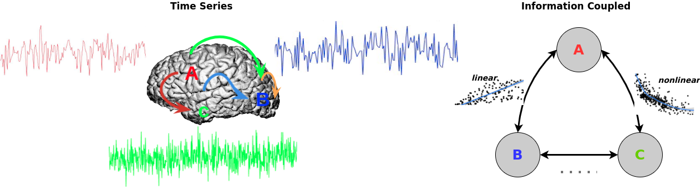

# **Functional Connectivity Inference from fMRI Data Using Multivariate Information Measures**

#### QiangLI

## Abstract

The brain signals have both a linear and a nonlinear distribution,
respectively. Furthermore, it has a great degree of dimension. In order
to understand cognitive processes in the brain. It is vital for us to
map out the flow of information in the brian. Or, to put it another way,
we should attempt to assess functional connectivity in the brain.

## Environments

  - Ubuntu 18.04 [x86_64-pc-linux-gnu (64-bit)]
  - Matlab 2020a
  - Python 3.8
  - R 4.0.3

## Guidelines for Codes [Requisites should be installed beforehand.]

  - Download dependencies toolbox for Matlab/Python/R
    
    The Matlab libraries are used to estimate conditional mutual
    information is listed as follows,
    [GCMI](https://github.com/robince/gcmi/blob/master/matlab/).
    
    Python libraries are used to download dataset and estimate
    multivariate mutual information are listed as follows,
    [Nilearn](https://nilearn.github.io/),
    [RBIG](https://isp.uv.es/RBIG4IT.htm),
    [CorEx](https://github.com/gregversteeg/CorEx).
    
    R packages used to visualize tree graph in this studies are listed
    as follows:
    [factoextra](https://cran.r-project.org/web/packages/factoextra/index.html),
    [igraph](https://igraph.org/r/),
    [entropy](http://www.strimmerlab.org/software/entropy/),
    [cluster](https://svn.r-project.org/R-packages/trunk/cluster/), and
    [gplots](https://cran.r-project.org/web/packages/gplots/index.html).

  - Reproduce figs in paper
    
    All of the figures can be replicated using the codes that have been provided. It is possible to plot the tree plot after you have saved the connection matrix and then utilized the previously stated R programs to do so.
    
  - Some function used from here and you are welcome to join me in making contributions to the     neuroscience-information-theory-python-toolbox project.
  
    People who want to learn more about information theory in neuroscience might use this Python toolkit.
    
    [neuroscience-information-theory-python-toolbox](https://bitbucket.org/qiangliuv/neuroscience-information-theory-python-toolbox/src/main/)

## Citation

Will be updated soon.
